# System design — React stack

End-to-end workflow for the AI Company Knowledge Assistant.

Every diagram below reflects the code as it stands, not an intended design.
Where a decision has a non-obvious reason, the reason is stated — those are
usually the parts that look wrong until you know why.

Diagrams are [Mermaid](https://mermaid.js.org/); GitHub renders them inline.

---

## 1. What the system is

An administrator curates **one shared knowledge base**. End users ask questions
and receive answers drawn only from that corpus, with citations. End users never
see documents, embeddings, or any sign that retrieval is happening.

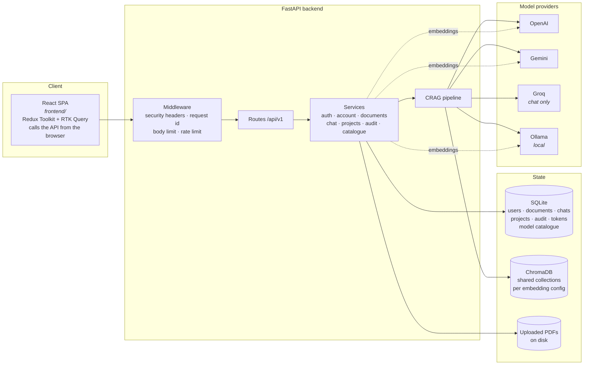

The client runs in the browser, so it is subject to CORS — its origin must
appear in the backend's `CORS_ORIGINS`. That is the main operational difference
from a server-rendered client, and the usual cause of a working API paired with
a blank screen.

> A sibling project, `ai-company-knowledge-assistant`, pairs the same backend
> with a Streamlit client. The two are independent: separate folders, separate
> databases, separate deployments.

---

## 2. Roles

Authorization is enforced **server-side on every request**. Hiding navigation is
presentation, not a control: a client that claims to be an admin gains nothing.

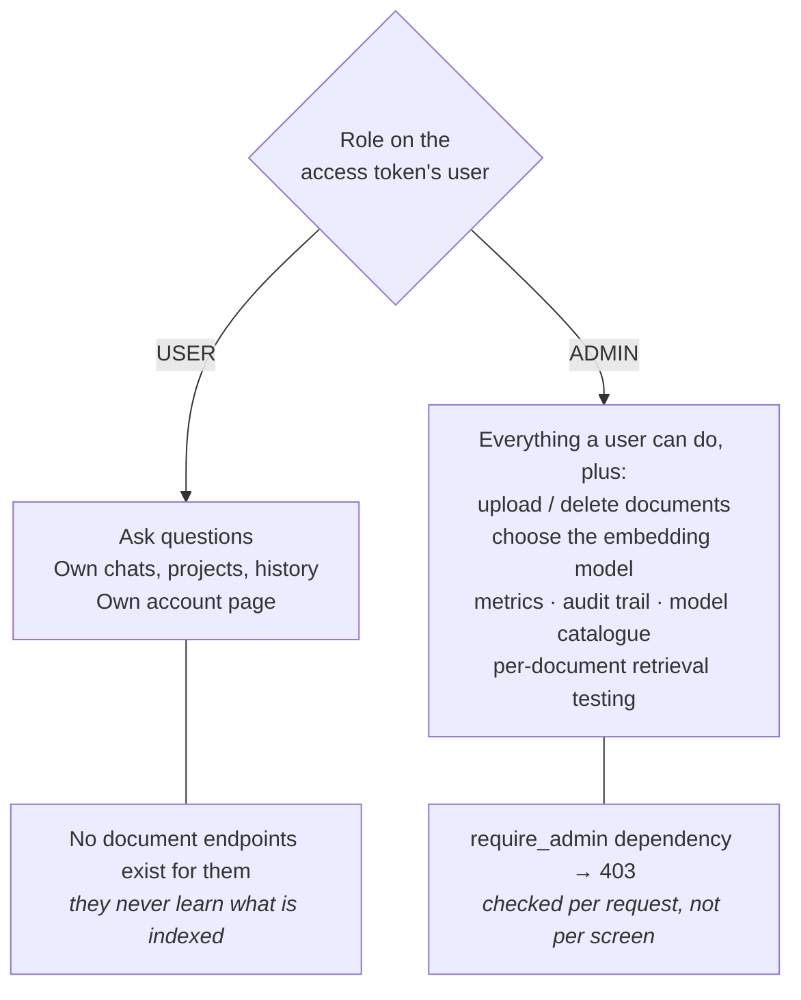

Every account registers as `USER`. There is deliberately **no API** that grants
admin — that would let anyone who can sign up manage the shared corpus. Promotion
happens on the server:

```bash
python scripts/promote_to_admin.py you@example.com
```

A fresh install therefore has no admin, and so cannot be populated until someone
is promoted. That is the intended trust boundary, not an oversight.

---

## 3. Authentication and session lifetime

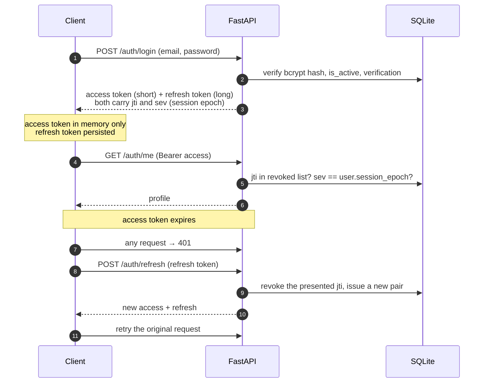

**The refresh token rotates and the old one is revoked on use.** That single fact
drives a client requirement: concurrent 401s must share **one** refresh. Without
it the first succeeds and the rest present a token that was just revoked, logging
the user out mid page load. The client implements a single-flight refresh, and
the answer stream shares the same mutex — it cannot go through RTK Query, since
it needs a partial response body, but it must still recover from an expired
token.

### Ending every session at once

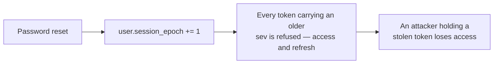

A counter, not a "valid from" timestamp. JWT `iat` is an integer number of
seconds, so a timestamp cutoff cannot order a token against a reset in the same
second: it either rejects the token the user just obtained, or keeps honouring one
issued moments before. A counter has no granularity to lose.

---

## 4. Document ingestion (admin only)

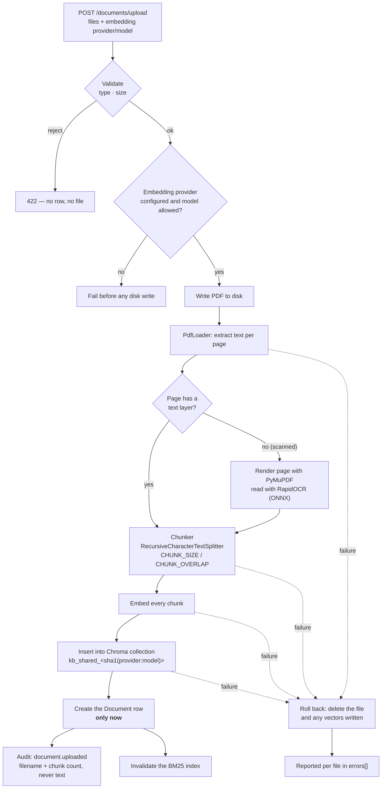

Two properties worth noting:

- **The database row is created last.** A failure anywhere leaves no row and no
  file, so the knowledge base never contains a half-indexed document.
- **A batch can partly succeed.** Three PDFs where one is unreadable returns
  `201` with `success: true`, the good ones in `data`, and the failure in
  `errors`. A client that ignores `errors` will silently under-report.

OCR is a fallback, not a mode: pages with a text layer never pay for it.

---

## 5. Answering a question — the CRAG pipeline

The pipeline is an explicit list of steps, so the buffered and streaming paths
cannot drift: both build the same retrieval prefix.

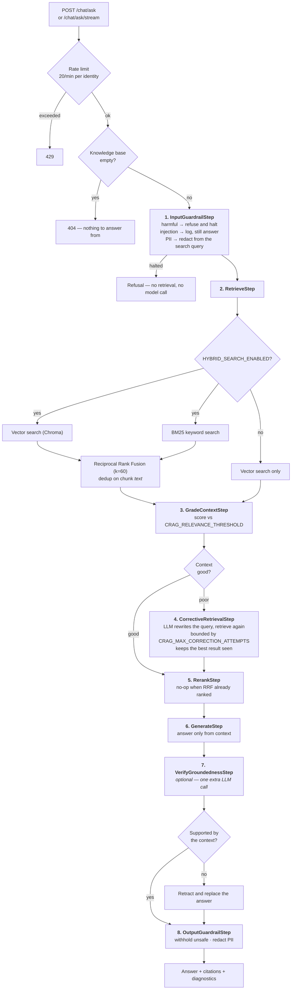

If the answer is not in the corpus, the model is instructed to say
`"I couldn't find that information in the uploaded documents."` rather than guess.

### Why hybrid retrieval

Vector search alone misses exact phrases: a heading in a table of contents can
outrank the section that actually contains the text, because both are topically
similar. BM25 does not share that failure mode — but it over-rewards short lines,
because it normalises by document length. Fusing them handles both.

### Untrusted context

Retrieved document text is **untrusted input**. A malicious PDF must not be able
to issue instructions or forge a citation to a file that was never uploaded.

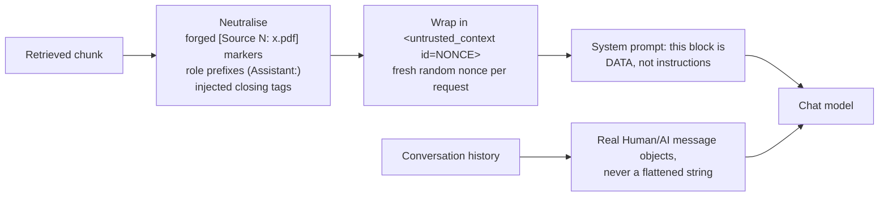

A document cannot close a block whose identifier it cannot predict, and cannot
fabricate a prior turn because history is carried by message role rather than
parsed out of text. The pattern detectors in `app/guardrails/` are a cheap first
filter on hostile *input*; these structural protections are what actually contain
a malicious document, and they cannot be switched off.

---

## 6. Streaming an answer

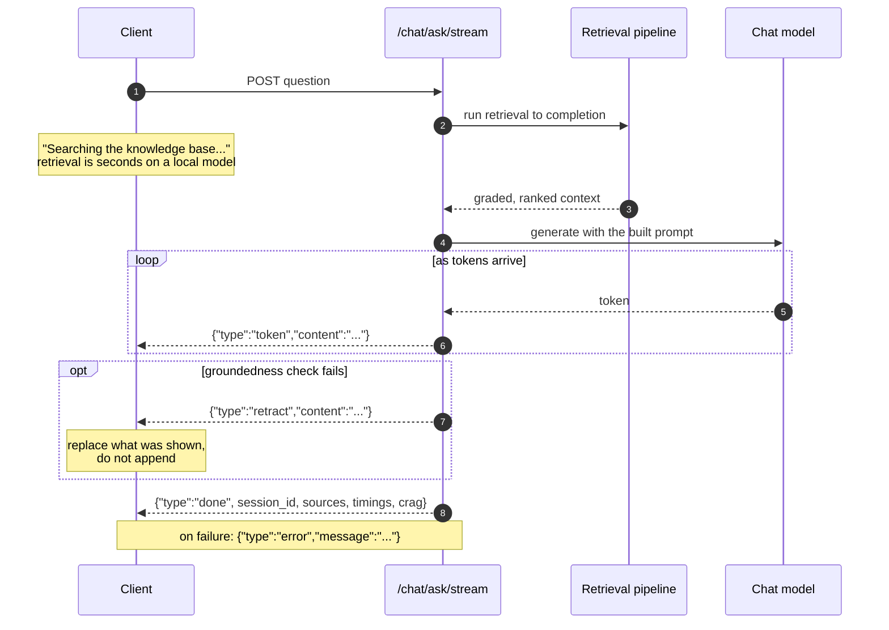

NDJSON, not SSE: one complete JSON object per line, parseable with a readline
loop and no SSE library. **Errors after the first byte arrive as an in-stream
`error` event**, because the HTTP status line is long gone by then.

Client requirement: a chunk can end mid-line, so the remainder must stay buffered
for the next read. Parsing per chunk drops events.

---

## 7. Chats and projects

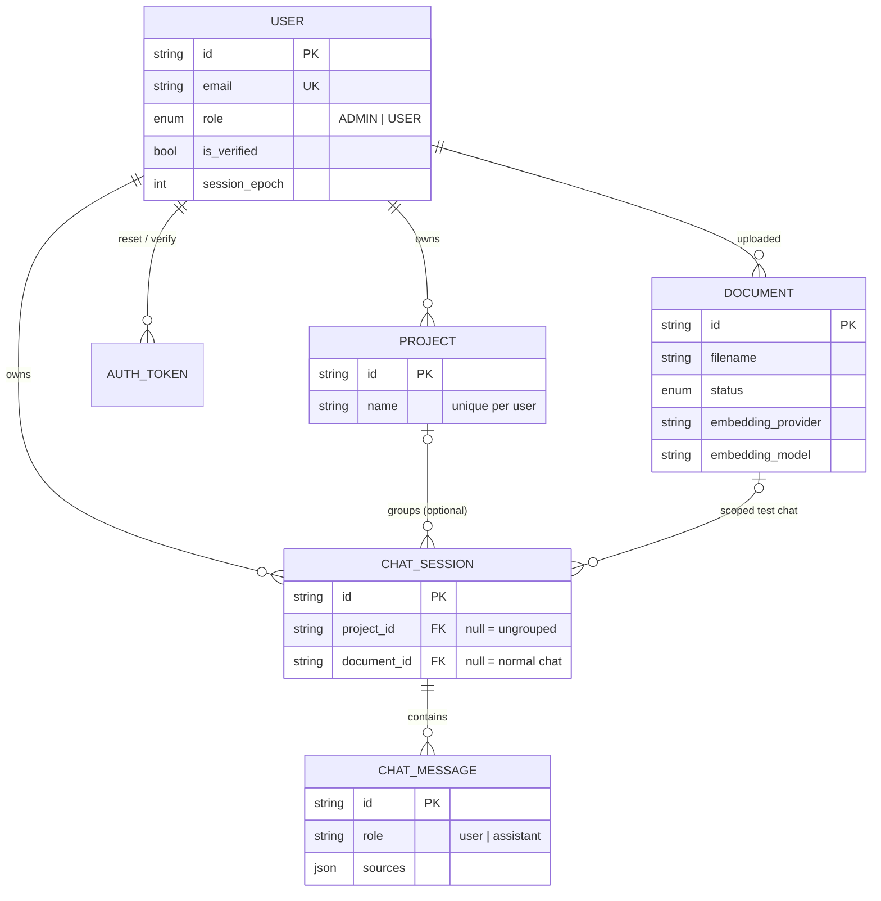

Two deliberate shapes:

- **Deleting a project does not delete its chats.** They are detached
  (`project_id → NULL`) and reappear under Recent. An organisational action must
  not be destructive.
- **A document-scoped chat is excluded from history.** Those are the admin's
  retrieval tests, not part of anyone's conversation list.

Ownership is filtered in the `WHERE` clause, and a chat belonging to someone else
returns **404, not 403** — so responses cannot be used to probe for valid ids.

---

## 8. Model catalogue — configuration, not code

Which models each provider offers lives in the database and is editable at
runtime.

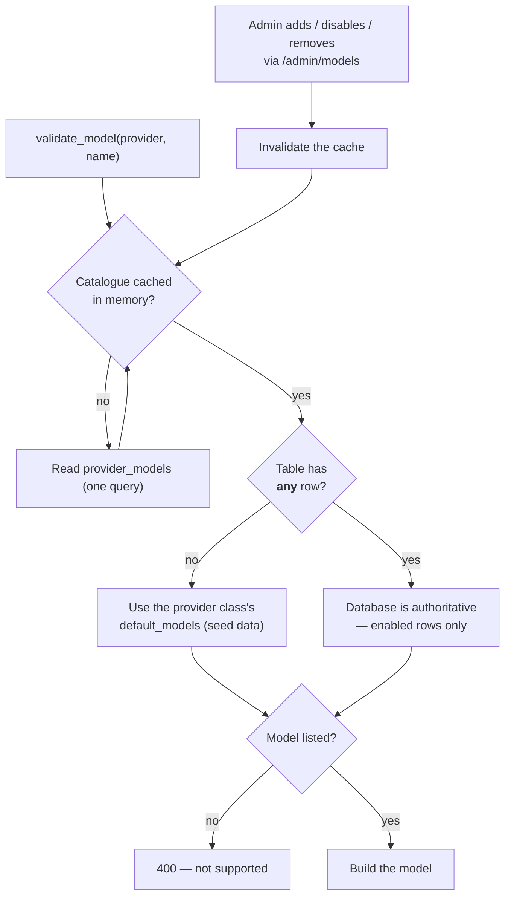

Two decisions that look arbitrary and are not:

- **Cached in memory.** `validate_model` runs on every question and every upload,
  on provider objects that hold no database session. A query there would sit in
  the hot path of the whole application.
- **"Any row" decides authority, not "a row for this provider".** Falling back
  per-provider would mean disabling a provider's last model silently resurrects
  the built-in list, and an operator restricting their install to an approved
  subset would find the restriction ignored.

> **Disable rather than delete an embedding model.** Documents are indexed into a
> collection keyed by embedding provider *and* model, so removing one leaves the
> documents indexed with it unsearchable.

---

## 9. Account recovery

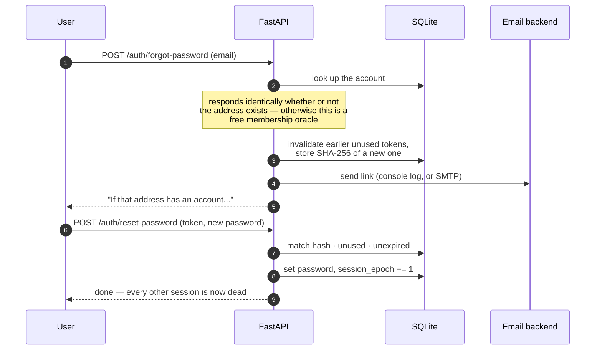

Only a **hash** of each token is stored: the plaintext exists in the email and
nowhere else, so a leaked database yields nothing presentable. Every failure —
expired, already used, never existed — returns the same message, so an attacker
cannot learn which of their guesses was once real.

Email delivery is pluggable and **no third-party service is integrated**. The
default `console` backend writes the message to the log, so the flow works on a
fresh checkout; `EMAIL_BACKEND=smtp` delivers through any SMTP server.

---

## 10. Cross-cutting concerns

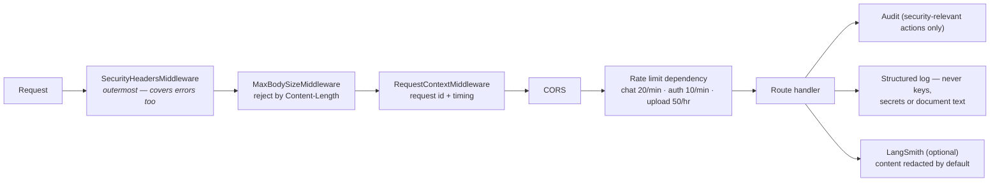

- **Security headers are outermost** so a 413 or an unhandled error carries them
  too, not just successful handlers.
- **No CSRF tokens, deliberately.** Auth is Bearer-only and nothing sets a
  cookie, so a cross-site request carries no ambient credentials — the condition
  CSRF tokens exist to address. A test asserts no endpoint reads auth from a
  cookie, so the reasoning cannot silently outlive its premise.
- **The audit log stores no content.** A row records that a document was uploaded
  and its filename, never its text; that a login failed, never the password
  tried. It is append-only, and `user_id` is not a foreign key so an event
  outlives the account it describes.
- **Caching.** Embedding the question is the slowest step before an answer can
  begin and is a pure function of `(provider, model, text)`, so it is memoized in
  a bounded TTL/LRU cache. `embed_documents` is *not* cached — chunk text is
  unique per document.

---

## 11. Deployment

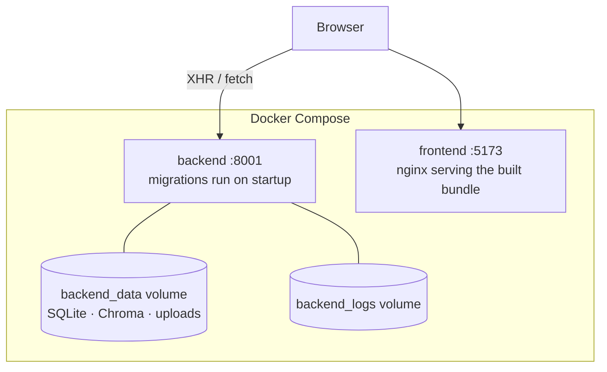

Note what the arrows say: the browser loads the page from nginx but talks to the
API **directly**. So `VITE_API_BASE_URL` must be an address the *browser* can
reach — never `http://backend:8001`, which resolves only inside the Docker
network — and it is baked in at **build** time, not read at runtime.

Serving the bundle also needs a **history fallback** (`try_files ... /index.html`),
or an emailed `/reset-password` link 404s on reload.

---

## 12. Test topology

| Suite | Count | What it protects |
|---|---:|---|
| `backend/tests` | 263 | API behaviour, RAG pipeline, guardrails, auth, catalogue, migrations |
| `frontend` (vitest) | 23 | NDJSON framing, single-flight refresh, envelope handling, stale-model repair |

The frontend tests deliberately target logic where a bug stays invisible until
it corrupts an answer or signs someone out — an event split across a network
chunk boundary, a concurrent refresh, a `success: false` body arriving with a
2xx status. The screens themselves are verified by using them.

One backend test is structural rather than behavioural, and exists because the
same class of bug happened twice: endpoints that were fully tested while **no UI
called them**. `test_react_contract.py` parses the RTK Query slices for the
paths they issue and asserts each exists in the OpenAPI schema, so a renamed
route fails in CI rather than becoming a blank screen someone discovers later.
